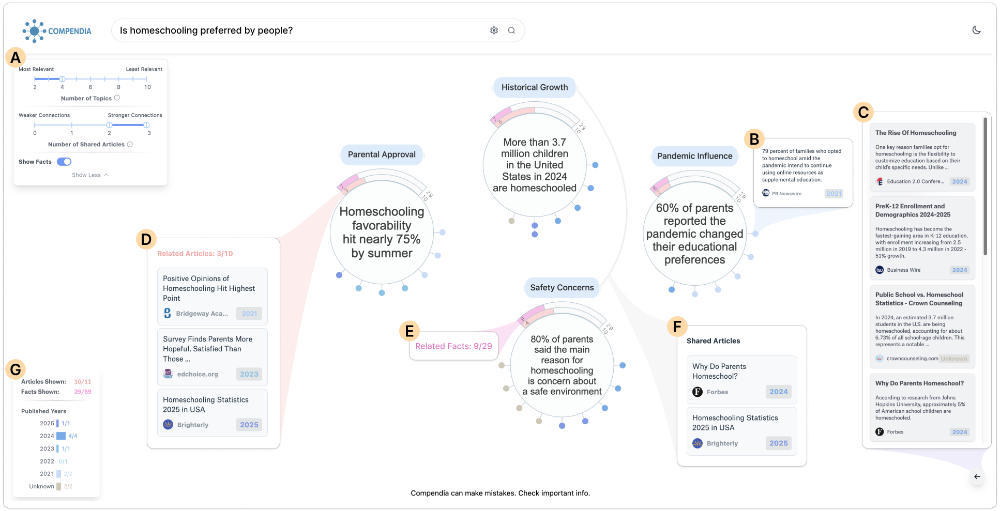

# Compendia 

**Compendia: Automated Visual Storytelling Generation from Online Article Collection**

Compendia is an automated system that analyzes online articles in response to a user's query and generates coherent data stories tailored to the user's informational needs. Data storytelling has emerged as a powerful medium for transforming complex information into engaging narratives that enhance understanding. While previous work has automated storytelling based on structured data like tables, Compendia explores the opportunities of converting unstructured text from online articles into compelling data stories.

## 🚀 Framework Overview

Compendia's framework consists of four distinct stages that transform unstructured online articles into interactive data stories:

### 1. 🔍 Online Article Retrieval
Retrieves relevant online articles based on the user's informational needs using advanced search algorithms and web crawling techniques.

### 2. 📊 Data Fact Extraction
Analyzes unstructured text to identify and extract key facts and data points using AI-powered natural language processing and information extraction techniques.

### 3. 🗂️ Fact Organization
Structures and groups the extracted facts into meaningful clusters, creating coherent thematic organizations that support narrative development.

### 4. 📖 Presentation Generation
Transforms the organized facts into interactive, data-driven stories presented through **Scrollytelling** - a technique that gradually unfolds the story as users scroll through the page.

## 🏗️ System Components

### 🔧 [Backend](https://github.com/compendia-project/compendia-backend) (compendia-backend)
A Python FastAPI-based service implementing the four-stage processing pipeline with AI-driven content analysis and story generation capabilities.

### 🎨 [Frontend](https://github.com/compendia-project/compendia-frontend) (compendia-frontend)
A modern Svelte-based web application featuring scrollytelling presentation with interactive data visualizations and progressive story revelation.

## 🎯 Key Innovation

Compendia addresses the gap in automated data storytelling by focusing on **unstructured text sources**. Online articles provide rich, contextually detailed information from various perspectives, making them an ideal source for automated data story generation. This approach enables the creation of comprehensive narratives that would be time-consuming to produce manually, requiring expertise in data analysis, storytelling, and design.

## 📈 Processing Workflow

1. **User Query**: User submits informational query defining their data story needs
2. **Article Retrieval**: System identifies and retrieves relevant online articles
3. **Fact Extraction**: AI analyzes unstructured text to extract key data facts
4. **Fact Organization**: Extracted facts are structured and clustered into meaningful groups
5. **Story Generation**: Organized facts are transformed into coherent narratives
6. **Scrollytelling Presentation**: Interactive story unfolds progressively as users scroll

---

*Compendia transforms the way we consume and understand information by automatically creating data-driven stories from the vast ocean of online content.*
